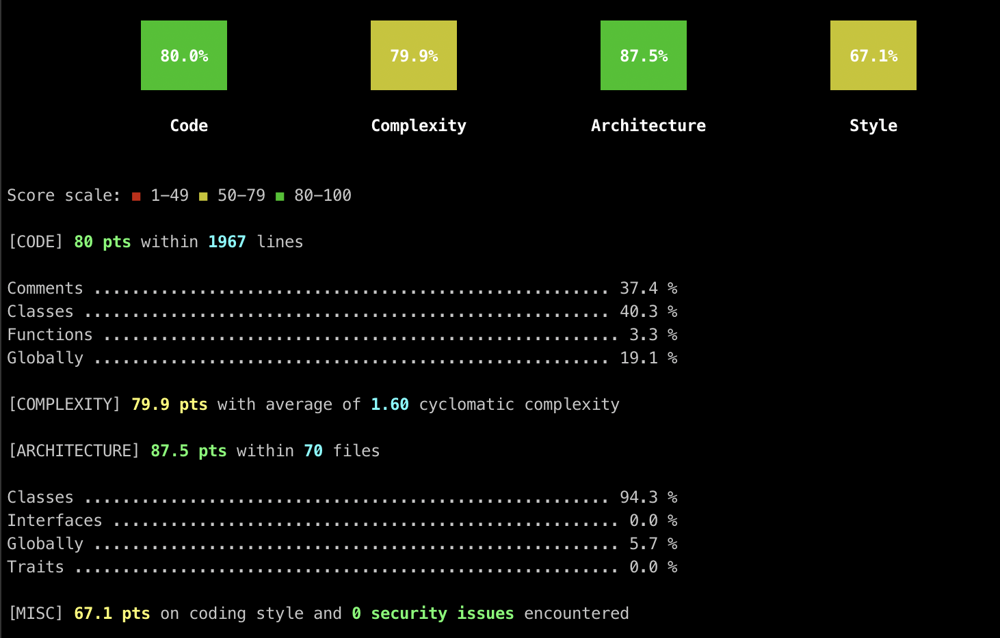

## Complexity

Code complexity can be a useful heuristic for understanding challenges to delivering change in software, understanding risks to increasing complexity, or identifying code smells. The various tools, (sometimes referred to as linters or static analyzers) that measure code complexity have a long list of markers, some common ones are:
* [Cyclomatic complexity](https://en.wikipedia.org/wiki/Cyclomatic_complexity)
* Nested loops and ifs
* Nested function calls
* Lines of code in functions
* Arguments in function signature
* Variable mutation

Many mature languages have CLI tools for measuring code complexity. Said tools often output something like this:

Below are some tools and example commands we have used on previous projects.

| Lang    | Tool | Example Config |
| -------- | ------- | ------- |
| PHP  |  | |
| Javascript | [ESlint](https://eslint.org/) | |
| Typescript | [TSlint](https://palantir.github.io/tslint/) | [example](./tslint.json) |
| C# .NET | [NDepend](https://marketplace.visualstudio.com/items?itemName=PatrickSmacchia.NDepend) | |
| Python | [radon](https://pypi.org/project/radon/) | |
| Dart | [Flutter Lints](https://pub.dev/packages/flutter_lints) | [example](./dart_analysis_options.yaml) |

### Source
Microsoft's [guidelines on code quality](
https://learn.microsoft.com/en-us/visualstudio/code-quality/code-metrics-cyclomatic-complexity?view=vs-2022)
